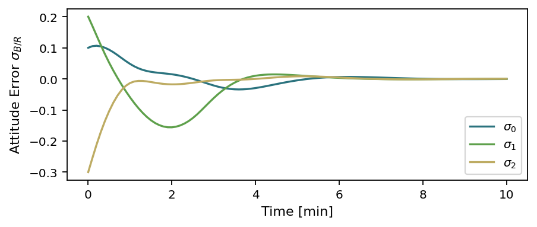
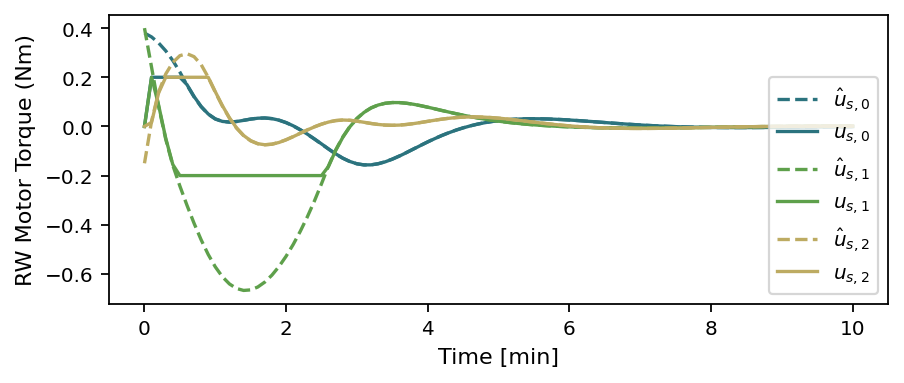
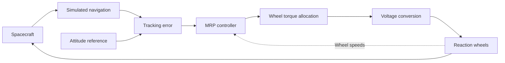

# AttitudeGuard

Spacecraft attitude control and fault-recovery experiments built on [Basilisk](https://github.com/AVSLab/basilisk).

**Current milestone:** upstream reaction-wheel baseline verified. Original quaternion control, sensor-fault detection, and recovery logic are next.

## Sprint progress

| Sprint | Goal | Status |
| :--- | :--- | :--- |
| 1 | Verify the environment and working example | Complete |
| 2 | Preserve the baseline, figures, and control path | Complete |

## Run the baseline

Use the existing environment on this machine:

```sh
cd ~/AttitudeGuard
source .venv/bin/activate
python sim/baseline/scenarioAttitudeFeedbackRW.py
```

To rerun both copies and refresh the saved figures and logs:

```sh
python docs/verify_baseline.py
```

**Configuration:** 10 minutes · 0.1-second step · voltage interface on · wheel jitter off.

## Baseline results

| Attitude tracking error | Reaction-wheel torque |
| :---: | :---: |
|  |  |

[All figures and run logs](results/baseline/) · [Configuration and control path](docs/baseline.md)

## Control loop



## Repository guide

| Folder | Contents |
| :--- | :--- |
| `docs/` | Baseline notes, environment record, and verification script |
| `sim/baseline/` | Preserved working simulation |
| `results/baseline/` | Verified figures and execution logs |
| `examples/` | Original Basilisk examples and supporting assets |

Environment: **macOS arm64 · Python 3.14.4 · Basilisk 2.12.0**. See the [environment record](docs/environment.txt) and [dependency snapshot](docs/requirements-baseline.txt).

The verified baseline demonstrates the upstream simulation. It does not yet demonstrate AttitudeGuard's original controller or fault recovery. Fresh-machine setup remains unverified.

Basilisk example code is credited to the Autonomous Vehicle Systems Lab, University of Colorado at Boulder. Its ISC notices remain in the source files.
